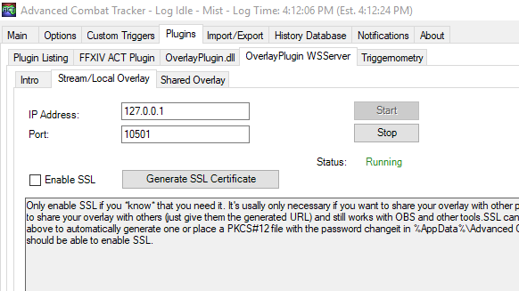
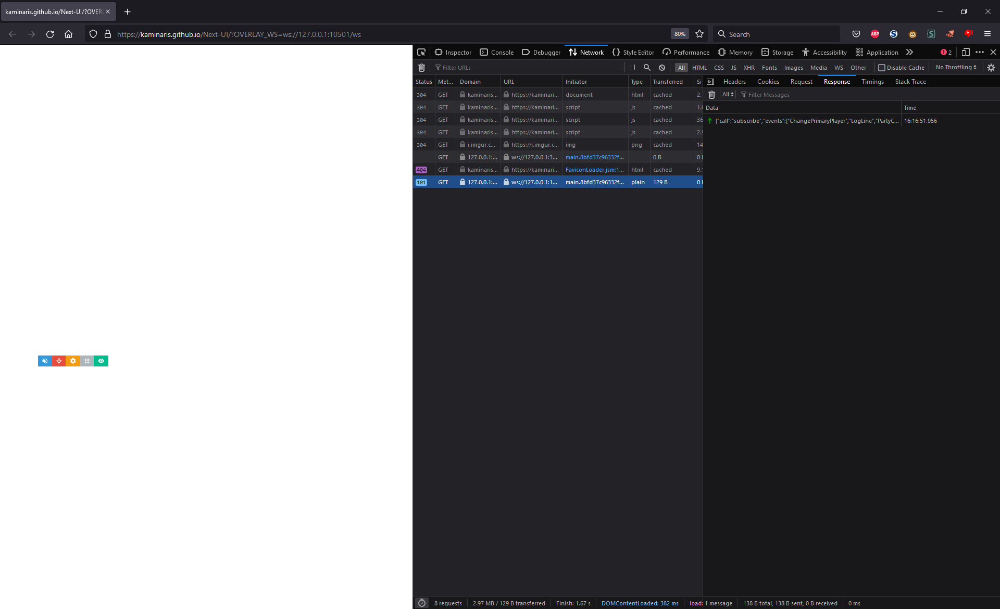

# Interfacing with OverlayPlugin

OverlayPlugin is a powerful ACT addon whose primary job is to feed data to and display overlays within the game.
However, you can skip the "overlay" part (or reimplement it yourself, as Triggevent does) and just use it as a data
feed.

## Basics

OverlayPlugin shares data with clients via WebSocket. In order to expose the WebSocket server to other clients, you must
first configure it on this tab:


Pick the IP address to listen on (127.0.0.1 or ::1 if you want to only accept local connections, best for security
unless you know you need otherwise). Then click "Start". Enable SSL if needed.

I won't go into the details of *how* WebSocket works. You can check out Triggevent as an example of a non-overlay
OverlayPlugin client, but the details of how you deal with the WebSocket connection will vary depending on what language
and WS library you use (if any).

## Learn by Example

OP Overlays can be run in a normal browser. Simply affix `OVERLAY_WS=ws://your.url.here:port/ws`. For example, after you
start the WS server, try opening [NextUI](https://kaminaris.github.io/Next-UI/?OVERLAY_WS=ws://127.0.0. 1:10501/ws). You
should see something similar to what you would see had you installed NextUI normally.

Then, open the browser devtools by pressing F12, and then select the Network tab. Reload the page, and then select the
network request with a status code of 101. You can then click on the "Response" tab, and see all the traffic to and from
the server:



(This is how it looks in Firefox - Chrome is the same process except the last tab is "Messages" rather than "Response").

## Two Types of Calls

There are generally only two pieces of data you would send to the server:

- Subscriptions
- One-off requests

### Subscriptions

First, read up on the [Event Types](https://github.com/ngld/OverlayPlugin/blob/master/docs/devs/event_types.md) that are
available to you.

To subscribe to an event, send the server a JSON message that looks like this:

```json
{
  "call": "subscribe",
  "events": [
    "ChangePrimaryPlayer",
    "LogLine",
    "PartyChanged",
    "EnmityTargetData",
    "EnmityAggroList",
    "onPlayerChangedEvent"
  ]
}
```

**Note:** some event sources come from other plugins. For example, the 'onPlayerChangedEvent' is from Cactbot, so it may
not work if the user does not have Cactbot installed.

You can subscribe to multiple events at a time, or subscribe in individual calls.

Then, when something happens, you'll receive a message back. Here is an example of a LogLine event:

```json
{
  "type": "LogLine",
  "line": [
    "40",
    "2021-11-30T21:13:49.6460000-08:00",
    "287",
    "Dravania",
    "The Cuff of the Son",
    "Forward Ring",
    "f155878771654d96106a2321e6ccb573"
  ],
  "rawLine": "40|2021-11-30T21:13:49.6460000-08:00|287|Dravania|The Cuff of the Son|Forward Ring|f155878771654d96106a2321e6ccb573"
}
```

The most important field here is 'type' - this tells you what type of event to expect, which will inform you as to what
the remaining fields are.

#### Cached Values

Some of these subscriptions are "cached" by OverlayPlugin. When you subscribe, the last message (which should indicate
the current state of things) will be sent immediately. For example, when you subscribe to ChangePrimaryPlayer or
ChangeZone, the current player or zone will be delivered to the client, as if it had happened right then and there.

### One-Offs

You can also send one-off requests. For example:

Request:

```json
{
  "call": "getCombatants",
  "rseq": 123456,
  "ids": 275160354
}
```

```json
{
  "combatants": [
    {
      "CurrentWorldID": 65,
      "WorldID": 65,
      "WorldName": "Midgardsormr",
      "BNpcID": 0,
      "BNpcNameID": 0,
      "PartyType": 1,
      "ID": 275160354,
      "OwnerID": 0,
      "type": 1,
      "Job": 28,
      "Level": 60,
      "Name": "Name Here",
      "CurrentHP": 22965,
      "MaxHP": 22965,
      "CurrentMP": 10000,
      "MaxMP": 10000,
      "PosX": 16.337,
      "PosY": 91.84852,
      "PosZ": 21.8319321,
      "Heading": -3.14159274
    }
  ],
  "rseq": 123456
}
```

The `rseq` value is important here. It is purely an echo of the `rseq` value in the request, but it is the only way to
correlate the message back with the response. There is also no type info in the response, so you also need `rseq` in
order to indirectly determine the type of the response, even if you don't actually care about correlating it back to an
exact request. The only time wh

The `rseq` value does not need to be a number, and it does not need to be unique. For example, Triggevent uses
`"allCombatants"` as the rseq for all of its requests to `getCombatants` for all combatants - it only cares about the
*type* of the message - the request is fire-and-forget.

One of the most important calls is `say`, as that is how you can have a TTS message be spoken by ACT.

Some other event types are available
[here](https://github.com/ngld/OverlayPlugin/blob/0da98d8045ec220d6c3d64f4dcf0edd3cd44a8f3/OverlayPlugin.Core/EventSources/MiniParseEventSource.cs#L104)
in the OverlayPlugin source.

