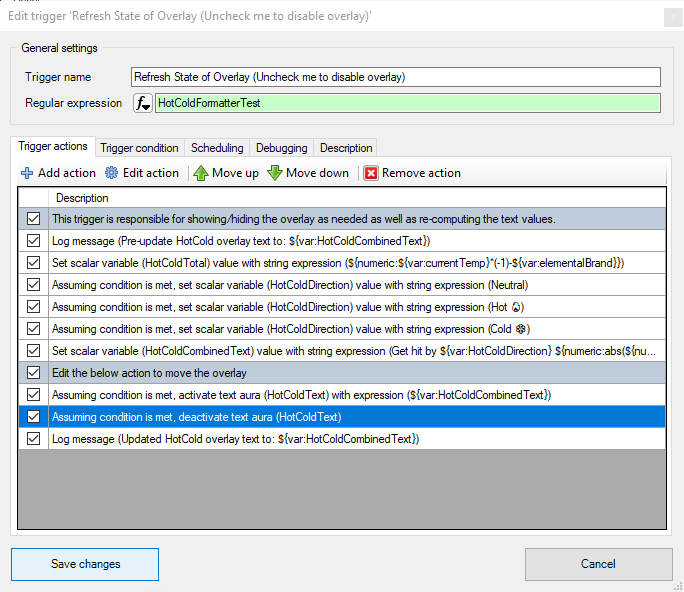
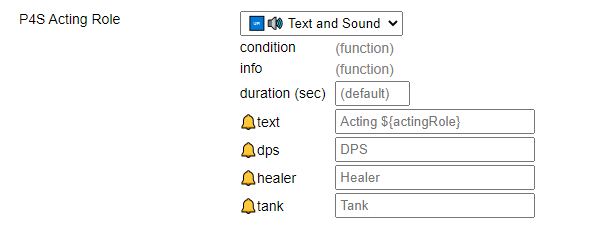
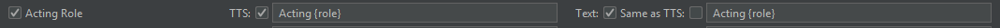
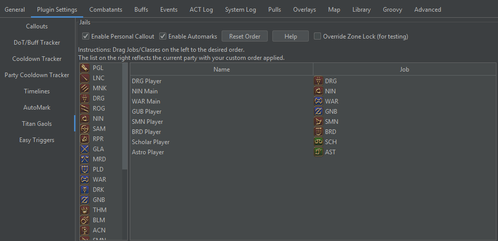
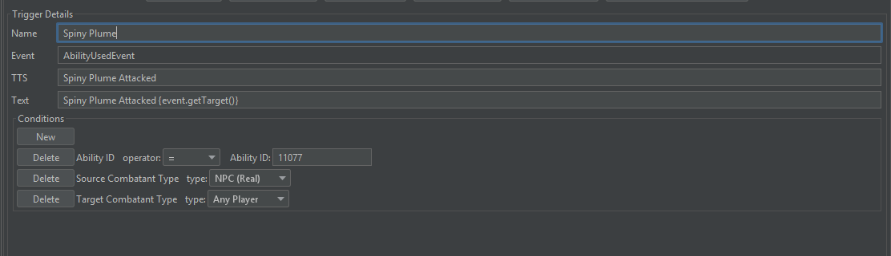

# What 3rd Party Tool Do I Use For X?

Or: quick start by use case guide

## Quick Overview of Each Tool Mentioned Here

### [Triggevent](https://github.com/xpdota/event-trigger)

Full disclaimer: I make this tool so I will probably be biased towards it. However, since I made it *specifically*
to address certain shortcomings in other solutions, it should not come as a surprise when I say that it does a
particular thing well. I wouldn't have bothered in the first place if I didn't think I could do better.

Triggevent is an all-in-one tool that supports triggers, timelines, overlays, and overall aims to be as powerful it can
be without being excessively complicated. It is also useful for inspecting a log after the fact, which has been used at
times to help make triggers for the other solutions.

The main disadvantages are that the look and feel of overlays aren't as customizable as other solutions, and that it has
very few triggers for pre-EW content.

### [Triggernometry](https://github.com/paissaheavyindustries/Triggernometry/)

Triggernometry is a build-it-from-scratch trigger system. It lets you make triggers with a point-and-click UI, and
supports variables, conditions, and indirectly supports loops. It also supports "repositories" which are packs of
triggers that will be auto-updated for you.

The main disadvantage is that the point-and-click interface becomes more of a hindrance than a help once triggers get to
a certain level of complexity. In addition, due to each trigger defining its own log line regex, things like log format
changes will break triggers and require each trigger to be fixed.

### [Cactbot](https://github.com/quisquous/cactbot/)

Cactbot is a comprehensive addon with multiple modules. Raidboss and Jobs are the main ones that we're interested in.
Raidboss provides timelines and triggers, while Jobs provides job-specific overlays, DoT tracking, and the like. Overall
a very good option for "I just want something that works". Customizing the callout text is easy, but adding your own
triggers could be a little better.

### Hojoring

Hojoring is a collection of addons. However, I caution against them, mostly due to significantly more complicated setup
than other addons combined with poor tech support for non-Japanese speakers. It does some things right - for example,
Special Spell Timer (SpeSpe) can do a multi-target DoT tracker, but you would have to manually add every DoT you want to
use to it.

## UWU Titan Jail/Gaol Plugin

"Personal Callout" means a callout that tells you and you alone what number jail you are (i.e. front/middle/back).

"Automark" refers to automatically using macros to put headmarkers on the jailed people.

"Change Prio Order" means the ability to configure the priority order (i.e. higher priority would be closer to front,
lower closer to back). This is important if any console players/non ACT users are in the party, since they should
ideally have front/back prio.

"No Manual Name Entry" means the plugin pulls the party list automatically rather than needing it to be manually
entered.

| Tool                                  | Personal Callout | Automark | Change Prio Order                                                | No Manual Name Entry                                                      | Notes                                                                                                 |
|---------------------------------------|------------------|----------|------------------------------------------------------------------|---------------------------------------------------------------------------|-------------------------------------------------------------------------------------------------------|
| Triggevent                            | ✅                | ✅        | ✅ - drag and drop                                                | ✅                                                                         | Unified, drag and drop to set up priority list once, works for both personal call and automark        |
| Triggernometry + King Pendragon Jails | ❌                | ✅        | ✅ - drag and drop but requires editing the trigger manually      | ✅                                                                         | Works better than old Triggernometry automarks, but still slightly more difficult to set up and debug |
| Cactbot                               | ✅                | ❌        | ❌ - hardcoded to be alphabetical                                 | ✅                                                                         | Cannot customize sort order                                                                           |
| Bespoke Jail Plugin (.dll)            | ✅                | ❌        | ✅ - no drag and drop, must be typed/pasted manually in each slot | ❌ requires manual entry of entire prio list or passing around an XML file | It's crap. Stop using it.                                                                             |

Maybe a little biased towards my own plugin, but half the reason I made it was **specifically** to have a Jail plugin
that was comprehensive, easy to use, and generally not terrible, so it had better do that well if nothing else.

## Dot Tracking

"DoTs supported" refers to whether you it supports a hardcoded/predefined list of DoTs, or whether you specify them
yourself. Hardcoded will be more ready to use out of the box, but will not accomodate new/niche things like Lost Flare
Star until support for that is added. Generally, this isn't hard (in Triggevent's case, literally just send me the
name/ID and I'll add it).

"TTS" refers to getting a voice callout when the DoT is about to expire.

"Visual" refers to some manner of on-screen display of the time remaining.

"Multi Target" refers to whether or not it can track a DoT on multiple targets at the same time.

"Tick Display" refers to some manner of displaying ticks on the tracker, if you want to try to optimize by delaying dot
refreshes when it wouldn't actually cost a tick. Example:


| Tool                         | DoTs supported                    | TTS | Visual | Multi Target | Tick Display                         |
|------------------------------|-----------------------------------|-----|--------|--------------|--------------------------------------|
| Triggevent                   | Fixed list                        | ✅   | ✅      | ✅            | ✅                                    |
| Various Triggernometry Repos | Fixed list + make your own        | ✅   | ✅      | ❌            | ✅ (but separate from the bar itself) |
| Cactbot jobs                 | Fixed list                        | ?   | ✅      | ❌            | ?                                    |
| Hojoring Special Spell Timer | Must make your own for everything | ?   | ✅      | ✅            | ?                                    |

## Cooldown Tracking

This refers to both personal cooldowns and party CDs.

"CDs supported", like with DoTs, refers to whether it uses a hardcoded or customizable list.

"Active Time Display" refers to whether it will show the time during which the buff is active, rather than just the
recast time.

| Tool                         | CDs supported              | TTS | Visual | Active Time Display |
|------------------------------|----------------------------|-----|--------|---------------------|
| Triggevent                   | Fixed list                 | ✅   | ✅      | ✅                   |
| Various Triggernometry Repos | Fixed list + make your own | ✅   | ✅      | ✅                   |
| Cactbot jobs                 | Fixed list                 | ✅   | ✅      | ?                   |

## Large Packs of Triggers and Timelines

### Triggernometry Repos

There are public repositories with many ready-to-go triggers for almost all content.

However, it does not have timeline support.

### Cactbot

Cactbot has support for almost all content.

It has timeline support, and timelines can be customized by placing a modified timeline file in the user directory.

### Triggevent

Nothing older than P1S is currently supported, making it the most bare in terms of existing content.

Timelines can be customized from within the UI, including the addition of icons and timeline triggers.

## Make Your Own Triggers and Timelines

| Tool           | Core Languages | User Language           | TTS | Overlays | Timelines | Timeline Customization | Offline Testing (Log File) | Offline Testing (FFLogs) |
|----------------|----------------|-------------------------|-----|----------|-----------|------------------------|----------------------------|--------------------------|
| Triggernometry | C#             | Point and Click         | ✅   | ✅        | ❌         | N/A                    | ✅                          | ❌                        |
| Cactbot        | C#, TS         | JS                      | ✅   | ✅        | ✅         | Edit File Manually     | ✅                          | ❌                        |
| Triggevent     | Java           | Groovy, Point and Click | ✅   | ✅        | ✅         | ✅                      | ✅                          | ✅                        |

### Vanilla ACT Triggers

Plain ACT triggers, under the "Custom Triggers" tab, are not very good. Here are the numerous disadvantages they have:

* Only supports parsed lines rather than network lines
* Cannot have a delay (thus it won't work for things like DoT or Cooldown reminders)
* Cannot attach conditions, making it difficult to do things like filtering to only a particular job
* Cannot have any state, making it useless for things like sequential headmarkers

Its main advantage is that it is included with ACT.

If you have been provided with one of these (it starts with `<Trigger`, both Triggevent and Triggernometry can import
and use these.

### Triggernometry

Example:


The editor is point-and-click. However, while minimal syntax checking exists, things like variable names are not
checked. While it has some support for making reusable pieces of code (triggers can call other triggers), complex things
get cumbersome fast.

### Cactbot

Triggers are written in Typescript if they are part of the codebase, or Javascript if they are a user addition.

For example, here is the code for P4S acting role debuff:

```ts
    {
      id: 'P4S Acting Role',
      type: 'GainsEffect',
      netRegex: NetRegexes.gainsEffect({ effectId: ['B6D', 'B6E', 'B6F'], capture: true }),
      condition: Conditions.targetIsYou(),
      infoText: (data, matches, output) => {
        const actingRoles: { [effectId: string]: string } = {
          'B6D': output.dps!(),
          'B6E': output.healer!(),
          'B6F': output.tank!(),
        };
        return output.text!({ actingRole: data.actingRole = actingRoles[matches.effectId] });
      },
      outputStrings: {
        text: {
          en: 'Acting ${actingRole}',
          de: 'Handel ale ${actingRole}',
          fr: 'Rôle ${actingRole}',
          ja: 'ロール: ${actingRole}',
          cn: '扮演 ${actingRole}',
          ko: '역할: ${actingRole}',
        },
        dps: roleOutputStrings.dps,
        healer: {
          en: 'Healer',
          de: 'Heiler',
          fr: 'Healer',
          ja: 'ヒーラ',
          cn: '治疗',
          ko: '힐러',
        },
        tank: {
          en: 'Tank',
          de: 'Tank',
          fr: 'Tank',
          ja: 'タンク',
          cn: '坦克',
          ko: '탱커',
        },
      },
    }
```

In addition, this results in a nice thing on the UI where you can customize the callouts, without having to edit the
trigger itself:



### Triggevent

Triggevent uses Java for everything in the codebase, and supports point-and-click Trigger creation like Triggernometry.
Its point-and-click doesn't do as much as Triggernometry, but is easier for some tasks due to discouraging the use of
regex and encouraging use of objects that have already been abstracted for you. Support for user-defined triggers
written in Groovy will be coming shortly.

That same Acting Role trigger from above:

```java
    private final ModifiableCallout<BuffApplied> acting=new ModifiableCallout<>("Acting Role","Acting {role}");

@HandleEvents
public void actingRole(EventContext context,BuffApplied event){
		if(event.getTarget().isThePlayer()){
		int id=(int)event.getBuff().getId();
final String role;
		switch(id){
		case 0xB6D->role="DPS";
		case 0xB6E->role="Healer";
		case 0xB6F->role="Tank";
default ->{
		return;
		}
		}
		context.accept(acting.getModified(event,Map.of("role",role)));
		}
		}
```

Like Cactbot, this results in a nice UI where the trigger's output can be customized:


Similar to placeholders in Cactbot callouts, these are supported. However, for the visual text, they are constantly
re-evaluated. Hence, something like this:


results in an on-screen callout that counts down, like this:


Or, if that isn't enough, a code-based Trigger can define its own configuration UI, as the Jail plugin does:



A user-defined trigger looks like this:



With regex based solutions, you'd first have to figure out that the regex for the spiny plume attacking is
`^21\|[^|]+\|[^|]+\|[^|]+\|2B45\|`. Then, you'd still have to add whatever extra conditions you want - in this case,
we're restricting the source entity to being an NPC, and the target entity to be a player. This is only an example, and
you could *probably* get away without those conditions, but it demonstrates how much easier and readable it is.